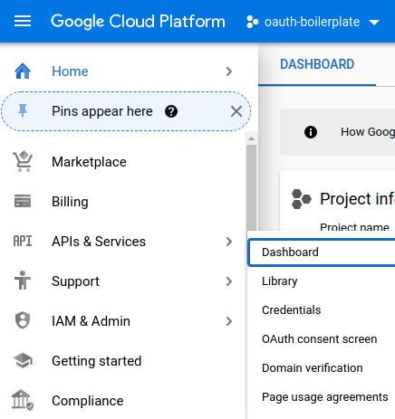
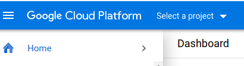
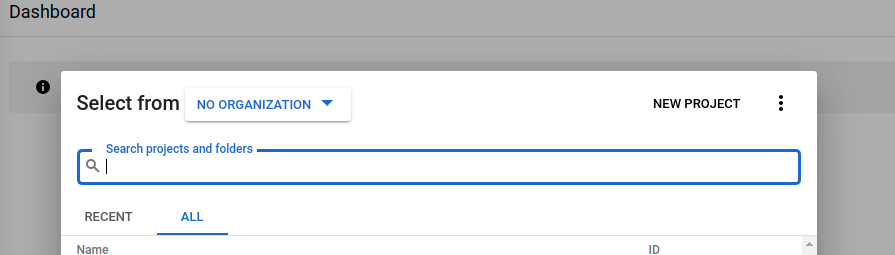
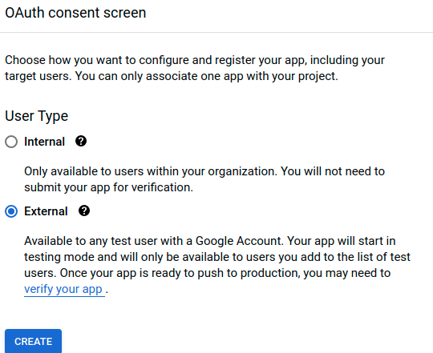
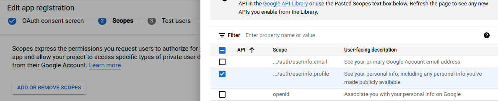
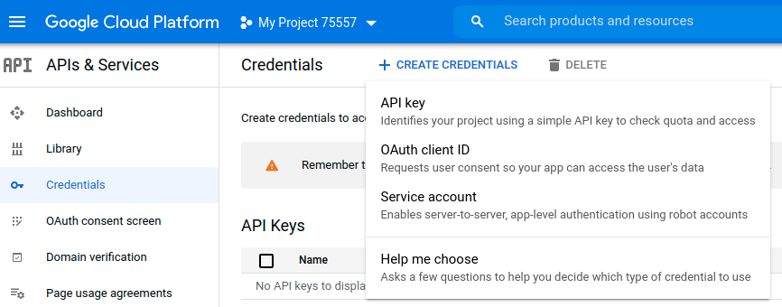
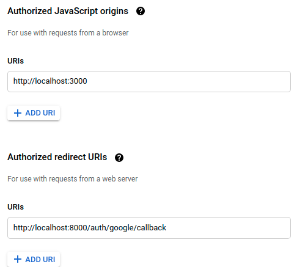
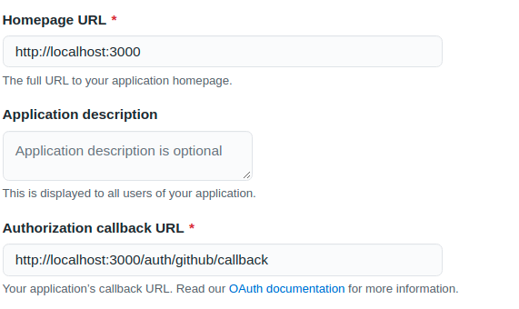

# OAuth Boilerplate - Server
This is a boilerplate for an Express app using Passport.js with Google and Github OAuth strategies for Authentication, using JWTs for Authorization, with a MongoDB backend for saving user data.


## Included Models
User Schema roughly adheres to this normalized format:
* http://www.passportjs.org/docs/profile/
* https://tools.ietf.org/html/draft-smarr-vcarddav-portable-contacts-00

### User
| Column | Type | Notes |
| ----------- | ---------- | ---------------------------- |
| _id | ObjectId | Primary key automatically added by MongoDB |
| provider | String | Where the user authenticated from (Google, Github, etc.) |
| provider_id | String | The id given to the user by provider |
| displayName | String |  |
| name | Object | name is an object containing three more key-value pairs |
| name.givenName | String |  |
| name.middleName | String |  |
| name.familyName | String |  |
| photos | Array | Array of Objects with key "value" |
| createdAt | Date | Automatically added by MongoDB |
| updatedAt | Date | Automatically added by MongoDB |

## Routes

| Method | Path | Purpose |
| ------ | ---------------------- | ---------------------------- |
| GET | `/` | Hello World! |
| GET | `/auth/google` | Passport redirects to Google to sign in |
| GET | `/auth/google/callback` | Handle the redirect back from Google with the user's data after sign in |
| GET | `/auth/github` | Passport redirects to Github to sign in |
| GET | `/auth/github/callback` | Handle the redirect back from Github with the user's data after sign in |
| GET | `/exampleResource` | An example route that only allows authenticated users access. Utilizes our custom built `authenticateJWT` middleware |


# Installation
## 1. Clone the repo down to your local machine
`git clone <repo_link> <new_name>`

## 2. Install dependencies
`npm install`

## 3. Create `.env` file for environment variables
**If you don't have a Google or Github application yet, scroll down below and refer to OAuth Provider Signup**
```
GOOGLE_CLIENT_ID=<your id from google>
GOOGLE_CLIENT_SECRET=<your secret from google>
GITHUB_CLIENT_ID=<your id from github>
GITHUB_CLIENT_SECRET=<your secret from github>
CLIENT_URL='http://localhost:3000 --- OR the url to your hosted client'
JWT_SECRET='A very secret secret of your own making'
```

## 4. Run the server 
`node server.js`

## 5. Delete the origin that points to the boilerplate repository
Currently if we run this command:

`git remote -v`

It will show origin as being hooked up to the boilerplate repository. We want a fresh repository instead, so let's delete the origin remote:

`git remote remove origin`
## 6. Create an empty git repository
Via the Github website. Follow directions as they show up when you create a new repository:
```
git init
git add .
git commit -m "Initial commit"
git remote add origin <new_repo_link>
git push origin main
```

# OAuth Provider Signup
## Google
**Instructions can also be found here:**

https://developers.google.com/identity/protocols/oauth2/web-server#creatingcred

---
### Create the Google App
1. Navigate to console.cloud.google.com and head to APIs & Services > Dashboard

2. Click on 'Select a project', click on 'NEW PROJECT', and create the project



4. Click on Configure Consent Screen
5. User Type 'External' then click Create

6. Set up your App name, User Support Email and click 'Save and Continue'
7. Click Add or Remove Scopes and add the 'profile' scope
 
9. Publish the App
 

---
### Create the Credentials
1. Click on Credentials and click on Create Credentials > OAuth clientID

2. Go through the setup steps:

* Application type - Web application
* Authorized JavaScript Origins
* Authorized Redirect URIs



3. The next popup modal will give you your Client ID and your Client Secret!

**KEEP THESE SECRET AND SAFE in your `.env` file!**

---
## Github
Instructions are found here: 

https://docs.github.com/en/developers/apps/creating-an-oauth-app

These instructions are pretty good - so follow them!

The URL and callback URL will end up looking like this:


